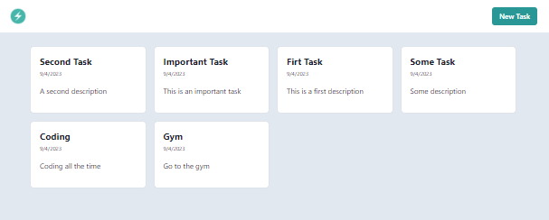
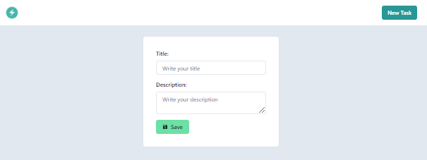

<h1 align="center">Task Web App with Nextjs, TypeScript and PostegreSQL Database</h1>

<div align="center">




</div>

## Introduction

This project is a web application designed for managing tasks. It is built using Next.js, TypeScript, Chakra UI, and PostgreSQL. The application allows users to create, read, update, and delete tasks. The project uses Next.js for server-side rendering and API routes, Chakra UI for styling, and PostgreSQL for data storage.

## 🔬 Project Structure

The application consists of several key components:

### Home Page

- Displays a list of tasks.
- If no tasks are available, it prompts the user to create a new task.
- Each task can be clicked to navigate to the edit page.

### New Task Page

- Allows users to create a new task.
- Users can input the title and description of the task.
- After submission, the user is redirected to the home page.

### Edit Task Page

- Allows users to edit an existing task.
- Users can update the title and description of the task.
- Users can also delete the task from this page.

## 📐 Architecture

- **public**: Static files for deployment.
- **src**: Contains the source code of the application:
  - **pages**: Main views of the application.
  - **components**: Reusable components.
  - **utils**: Utility functions, such as database connection.
  - **models**: Data models, such as the `Task` interface.
  - **styles**: Global styles.

## 🔨 Installation and Configuration

### 1. Clone the Repository

```bash
git clone https://github.com/your-username/nextjs-postgres-crud-typescript.git
cd nextjs-postgres-crud-typescript
```

### 2. Install Dependencies

Ensure you have Node.js installed. Then, run:

```bash
npm install
```

### 3. Configure the Database

Ensure you have PostgreSQL installed and configured. The database credentials are located in src/utils/database.ts. Make sure to adjust them according to your configuration.

### 4. Run the Application

#### Development Mode

To start the development server, run:

```bash
npm run dev
```

This will start the server at http://localhost:3000/.

#### Production Mode

To create a production build of the application, run:

```bash
npm run build
```

Then, you can start the production server with:

```bash
npm start
```

## 📭 API Endpoints

### Ping Endpoint

- **Endpoint**: `GET /api/ping`
- **Description**: Checks the connection to the PostgreSQL database.
- **Response**: JSON object with a message and the current time from the database.

### Tasks Endpoint

- **Endpoint**: `GET /api/tasks`
- **Description**: Retrieves all tasks from the database.
- **Response**: Array of `Task` objects.

- **Endpoint**: `POST /api/tasks`
- **Description**: Creates a new task.
- **Request Body**:
  - `title`: Task title (string).
  - `description`: Task description (string).
- **Response**: Newly created `Task` object.

### Task by ID Endpoint

- **Endpoint**: `GET /api/tasks/:id`
- **Description**: Retrieves a specific task by its ID.
- **Parameters**:
  - `id`: Task ID (string).
- **Response**: `Task` object.

- **Endpoint**: `PUT /api/tasks/:id`
- **Description**: Updates a specific task by its ID.
- **Parameters**:
  - `id`: Task ID (string).
- **Request Body**:
  - `title`: New title (string).
  - `description`: New description (string).
- **Response**: Updated `Task` object.

- **Endpoint**: `DELETE /api/tasks/:id`
- **Description**: Deletes a specific task by its ID.
- **Parameters**:
  - `id`: Task ID (string).
- **Response**: Deleted `Task` object.

## 🚀 Deployment

The application can be deployed to any platform that supports Next.js, such as Vercel, Netlify, or a custom server.

Deploying to Vercel
Install the Vercel CLI:

```bash
npm install -g vercel
```

Deploy the application:

```bash
vercel
```

Follow the prompts to complete the deployment.
